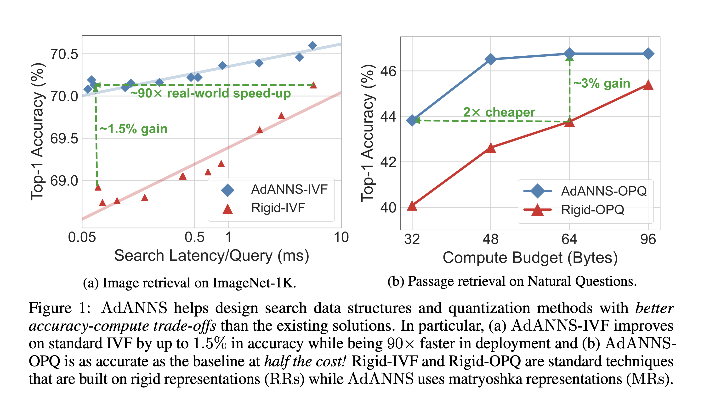
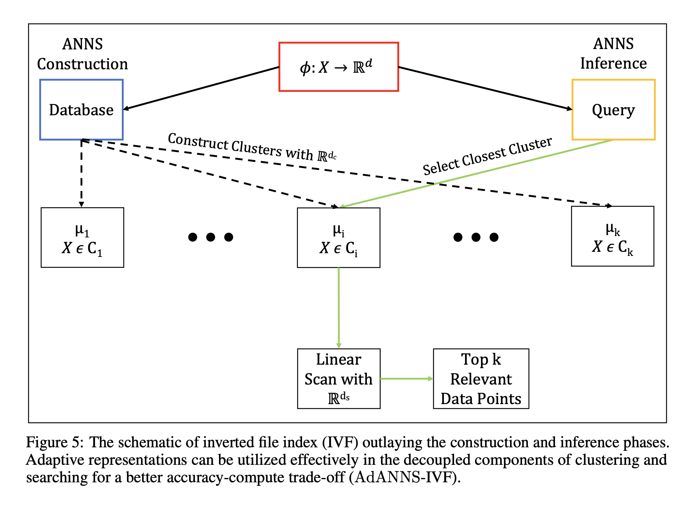

# [AdANNS: A Framework for Adaptive Semantic Search]()
_Aniket Rege, Aditya Kusupati, Sharan Ranjit S, Alan Fan, Qingqing Cao, Sham M. Kakade, Prateek Jain, Ali Farhadi_

Learned representations are used in multiple downstream tasks like web-scale search & classification. However, they are flat & rigid—information is diffused across dimensions and cannot be adaptively deployed without large post-hoc overhead. We propose the use of adaptive representations to improve approximate nearest neighbour search (ANNS) and introduce a new paradigm, AdANNS, to achieve it at scale leveraging matryoshka representations (MRs). We compare AdANNS to ANNS structures built on independently trained rigid representations (RRs).

<p align="center">

</p>

This repository contains code for AdANNS construction and inference built on top of Matryoshka Representations (MRs). The training pipeline to generate MRs and RRs can be found [here](https://github.com/RAIVNLab/MRL). The repository is organized as follows:

1. Set up
2. Inference to generate MRs and RRs
3. AdANNS Experiments


## Set Up
Pip install the requirements file in this directory. Note that a python3 distribution is required:
```
pip3 install -r requirements.txt
```

## [Inference on Trained Models](inference/)
We primarily utilize ResNet-50 MRL and Rigid encoders ("Fixed-Feature" in original MRL terminology) for a bulk of our experimentation. We also utilize trained MRL ResNet18/34/101 and ConvNeXT encoders as an ablation study. Inference on trained models to generate MR and RR embeddings used for downstream ANNS is provided in `inference/pytorch_inference.py`, and is explained in more detail in the [original MRL repository](https://github.com/RAIVNLab/MRL).


## [AdANNS](retrieval/)
`cd adanns`

We provide code showcasing AdANNS in action on a simple yet powerful search data structure – IVF (AdANNS-IVF) – and on industry-default quantization – OPQ (AdANNS-OPQ) – followed by its effectiveness on modern-day ANNS composite indices like IVFOPQ (AdANNS-IVFOPQ) and DiskANN (AdANNS-DiskANN).

A more detailed walkthrough of AdANNS can be found in [`adanns/`](adanns/)

<p align="center">

</p>

## Citation
If you find this project useful in your research, please consider citing:
```
@article{rege2023adanns,
      title={AdANNS: A Framework for Adaptive Semantic Search}, 
      author={Aniket Rege and Aditya Kusupati and Sharan Ranjit S and Alan Fan and Qingqing Cao and Sham Kakade and Prateek Jain and Ali Farhadi},
      year={2023},
      eprint={2305.19435},
      archivePrefix={arXiv},
      primaryClass={cs.LG}
}
