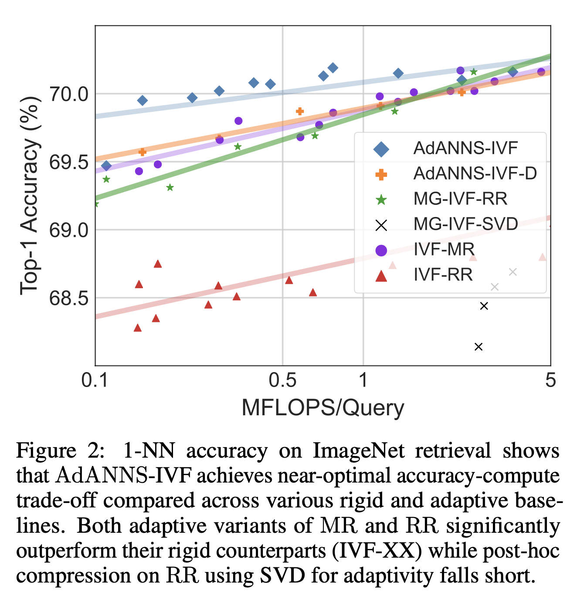
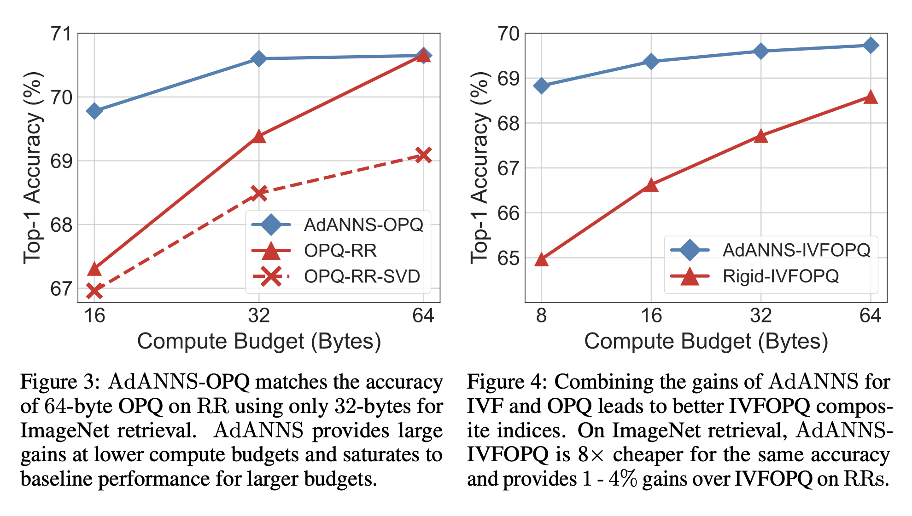

# Overview
The directory structure is organized as follows:
1. AdANNS-IVF (see Figure 2) in an [optimized](#optimized-adanns-ivf) and [unoptimized](#unoptimized-adanns-ivf) fashion
2. [Non Adaptive Pipeline](#non-adaptive-search) on ImageNet-1K
3. AdANNS with DiskANN, a graph based Memory-SSD hybrid ANNS index in [diskann](diskann/README.md)
4. AdANNS with Dense Passage Retriever (DPR) on [Natural Questions](https://ai.google.com/research/NaturalQuestions) (NQ) in [dpr-nq](dpr-nq/README.md)

## Optimized AdANNS-IVF
[`adanns-ivf-optimized.ipynb`](adanns-ivf-optimized.ipynb) implements _AdANNS_-IVF in an optimized fashion (native Faiss) and is drawn from a [Faiss case study](https://gist.github.com/mdouze/8c5ab227c0f7d9d7c15cf92a391dcbe5#file-demo_independent_ivf_dimension-ipynb). During index construction, $d_c$ is used for coarse quantization (centroid assignment), and all database vectors are pre-assigned to their appropriate clusters with this coarse quantizer. We also typically learn a fine quantizer (OPQ) with $d_s$ for fast distance computation. During the search phase, for a given query, nprobe clusters are shortlisted with $d_c$, and linear scan is done via a PQ lookup table which is constructed from $d_s$ over all shortlisted clusters.

Note that currently the optimized version supports only $d_s \ge d_c$ during index construction.

## Unoptimized AdANNS-IVF
[`adanns-ivf-unoptimized.ipynb`](adanns-ivf-unoptimized.ipynb) implements a fully-decoupled ANNS pipeline; $d_c < d_s$ is now possible. This is carried out in a highly unoptimized fashion: during construction, we utilize pre-constructed *k-means* indices indexed over the database with $d_c$, and build an inverted file lookup that maps each database item to its closest cluster centroid. During search time, we iterate over each centroid and perform a batched search over every queryset vector corresponding to that centroid with $d_s$. This approach scales linearly in cost with the number of centroids $\mathcal{O}(N_C)$, and results in higher wall-clock times during search than the optimized version above.

## Non-Adaptive Search

For all other experiments with Faiss (IVF-XX, MG-IVF-XX, OPQ, IVFOPQ, HNSWOPQ) on ImageNet-1K, we have a 3-stage pipeline:
1. Encoder inference to generate embeddings for database and queries: see [run-inference.sh](../generate_embeddings/run-inference.sh)
2. Index construction (database) and search (queries) on generated embeddings to generate k-NN arrays: see [generate_nn](generate_nn/)
3. Metric computation or Ablations on top of k-NN arrays: see [compute_metrics.ipynb](compute_metrics.ipynb) and [ablations](ablations/)