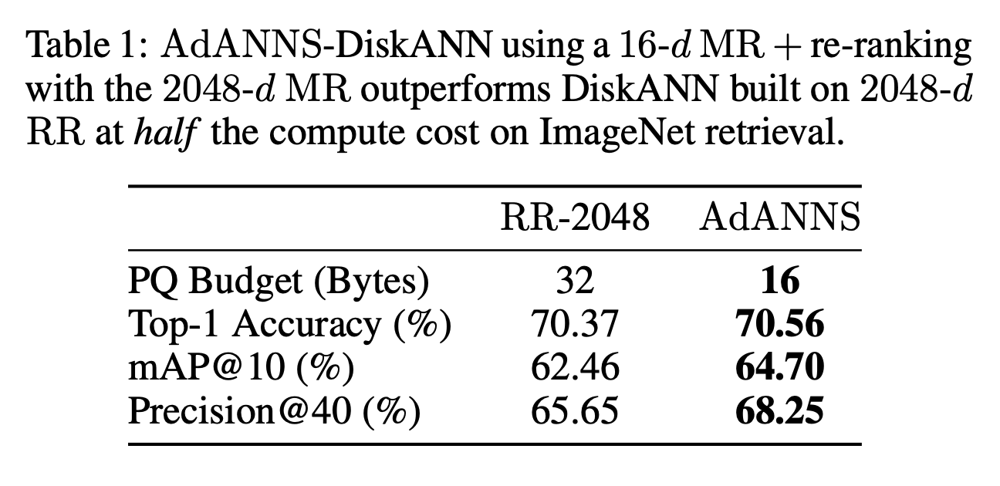

# AdANNS-DiskANN
AdANNS-DiskANN is a variant of [DiskANN](https://github.com/microsoft/DiskANN), a web-scale graph-based ANNS index capable of serving queries from both RAM and Disk (cheap SSDs).

<p align="center">

</p>


We provide a self-contained pipeline in [adanns-diskann.ipynb](adanns-diskann.ipynb) which requires a build of DiskANN provided in the [original codebase](https://github.com/microsoft/DiskANN) and summarized below:

```
sudo apt install make cmake g++ libaio-dev libgoogle-perftools-dev clang-format \
 libboost-all-dev libmkl-full-dev

mkdir build && cd build && cmake -DCMAKE_BUILD_TYPE=Release .. && make -j 
```

## Notebook Overview
[adanns-diskann.ipynb](adanns-diskann.ipynb) is broadly organized as:
1. Data preprocessing: convert MR or RR embeddings (fp32 `np.ndarray`) to binary format
2. Generate exact-search "ground truth" used for k-recall@N
3. Build In-Memory or SSD DiskANN index on MR or RR
4. Search the built indices to generate k-NN arrays
5. Evaluate the k-NN arrays with and without reranking