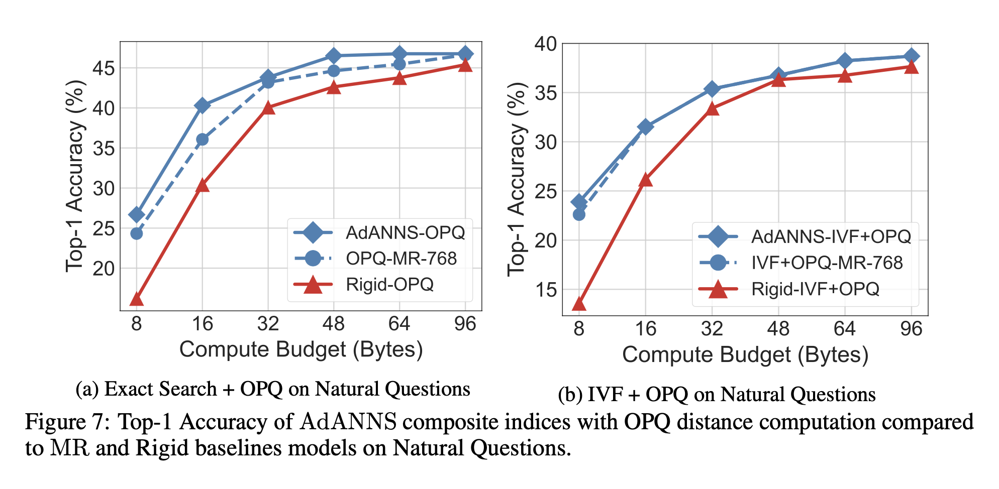

# AdANNS with DPR on NQ

We follow the setup on the [Dense Passage Retriever](https://github.com/facebookresearch/DPR) (DPR) repo. The Wikipedia corpus has 21 million passages and Natural Questions (NQ) dataset for open-domain QA settings. AdANNS with DPR on NQ is organized as:
1. Index Training for IP, L2, IVF, OPQ, IVFOPQ. Currently supported 
    - In batches (RAM-constrained, ~2 hours build time) 
    - One shot (~120G peak RAM usage, ~2 minutes build time)
2. DPR eval (available on request)